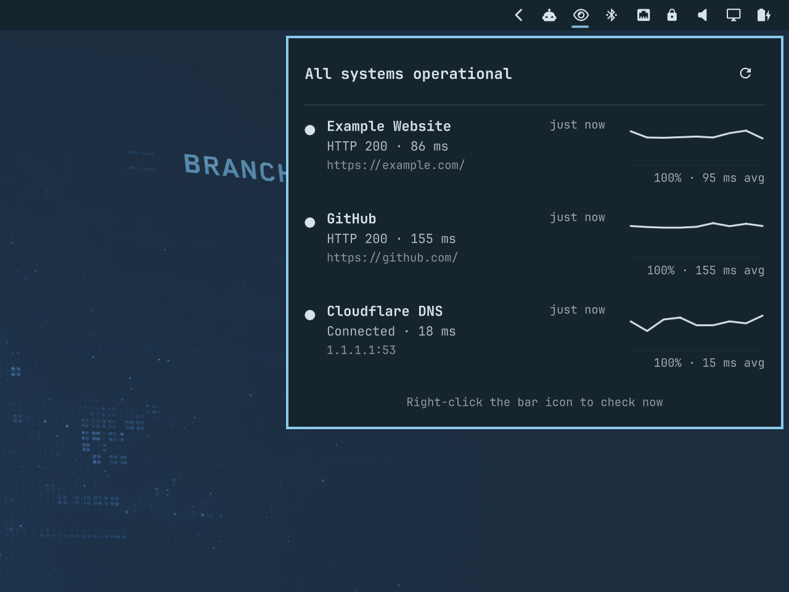

# OmaNetWatch

OmaNetWatch is an Omarchy shell plugin that monitors HTTP, TCP, structured JSON status endpoints, and RSS/Atom incident feeds from a native bar popup.



## Current features

- One background monitoring service, even with multiple monitors
- HTTP checks with an expected status code
- TCP host/port checks
- JSON status checks with configurable field paths and health mappings
- RSS/Atom incident updates with quiet first-run baselining and persistent deduplication
- Operational, degraded, outage, and unknown health states
- Native add, edit, enable/disable, and remove controls in the popup
- Independent interval, timeout, and failure threshold per endpoint
- Alert on non-operational state changes after the configured threshold; notify again on recovery
- Bar summary with a detailed, theme-aware popup
- Right-click the bar icon, or use the popup button, to check everything immediately
- Live reload when the targets file changes
- Rolling 30-check latency and availability history with a sparkline for each target
- History persisted across shell restarts in `~/.local/state/omanetwatch/history.json`

## Install

Install directly from GitHub and enable the bar widget:

```bash
omarchy plugin add https://github.com/keithnyc/omanetwatch.git --enable
```

Open the bar popup and press `+` to add your first service. The manage button exposes enable, edit, and remove actions.

To start from the bundled GitHub Status and Cloudflare Status examples instead, copy the example configuration:

```bash
mkdir -p ~/.config/omanetwatch
cp ~/.config/omarchy/plugins/io.github.keithnyc.omanetwatch/config.example.json \
  ~/.config/omanetwatch/targets.json
```

The examples are disabled by default. Enable them in the popup or edit `~/.config/omanetwatch/targets.json`. The JSON file remains the portable backing store and reloads automatically when changed by hand.

## Install for local development

Create the configuration file:

```bash
mkdir -p ~/.config/omanetwatch
cp config.example.json ~/.config/omanetwatch/targets.json
```

Install the plugin by linking this checkout into Omarchy's user plugin directory:

```bash
ln -s "$PWD" ~/.config/omarchy/plugins/io.github.keithnyc.omanetwatch
omarchy-shell shell rescanPlugins
omarchy plugin enable io.github.keithnyc.omanetwatch right
```

Health checks deliberately start with two consecutive non-operational checks required before notification. This avoids alerting on a single transient timeout or malformed response. Feed targets notify on new or meaningfully updated items after establishing a quiet baseline on their first successful check.

## Configuration

OmaNetWatch watches `~/.config/omanetwatch/targets.json` and reloads it automatically. The root is an array containing HTTP, TCP, JSON, and/or feed targets.

HTTP target fields:

- `name`: display name
- `type`: `http`
- `url`: complete `http://` or `https://` URL
- `expectedStatus`: expected HTTP response, default `200`

TCP target fields:

- `name`: display name
- `type`: `tcp`
- `host`: DNS name or IP address
- `port`: TCP port

JSON status target fields:

- `type`: `json`
- `url`: JSON endpoint URL
- `expectedStatus`: expected HTTP response, default `200`
- `statusPath`: field containing the provider status. Use a dot path such as `status.indicator` or a JSON Pointer such as `/status/indicator`.
- `statusMap`: maps exact, case-sensitive provider values to `operational`, `degraded`, `outage`, or `unknown`
- `reasonPath`: optional field containing a short human-readable description
- `sourceUrl`: optional status page shown in the popup; defaults to `url`

RSS/Atom feed target fields:

- `type`: `feed`
- `url`: public RSS or Atom feed URL
- `expectedStatus`: expected HTTP response, default `200`
- `sourceUrl`: optional public status page; individual items use their own links when available

The first successful feed check records existing items without notifying. Later checks notify for new item IDs and for changed content on known IDs. Up to 200 fingerprints per feed are retained across shell restarts, and the latest item remains visible in the popup. Feed activity is separate from current service health: an incident post does not change operational/degraded/outage counts.

Missing fields, invalid JSON/XML, oversized responses, and unmapped status values are reported as `unknown`; they are never treated as healthy. JSON and feed responses are limited to 1 MiB. GitHub Status, Cloudflare Status, and xAI incident-feed examples are included in `config.example.json`, disabled by default.

Common optional fields:

- `id`: stable unique identifier; derived from `name` when omitted
- `enabled`: whether to schedule checks and alerts; default `true`. Disabled targets remain visible in the popup.
- `intervalSeconds`: seconds between checks, default `60`
- `timeoutSeconds`: per-check timeout, default `5`
- `failuresBeforeAlert`: consecutive failures before notifying, default `2`

## Dependencies

- Omarchy shell with third-party service and bar-widget support
- Python 3
- `omarchy-notification-send`

Plugins execute unsandboxed inside `omarchy-shell`. Review local and third-party plugin code before enabling it.

## Remove

Remove the plugin with Omarchy:

```bash
omarchy plugin remove io.github.keithnyc.omanetwatch
```

Removal leaves your target configuration and history intact. If you no longer
want that local data, you may separately delete
`~/.config/omanetwatch/targets.json` and
`~/.local/state/omanetwatch/history.json`.

## Privacy

OmaNetWatch makes checks directly from your computer. Target configuration and
check history remain local in `~/.config/omanetwatch/targets.json` and
`~/.local/state/omanetwatch/history.json`; neither file belongs in this repository.

## License

MIT
